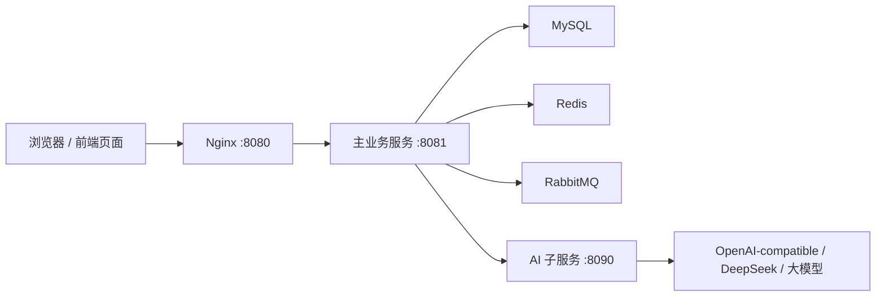

# checkpointv1.0

## 项目框架

这是一个“黑马点评 + AI 改造”的双服务项目：

1. 主业务服务
   - 路径：`dianping-nginx-1.18.0`
   - 负责用户、店铺、笔记、关注、点赞、秒杀、Redis 缓存、RabbitMQ 下单、AI 接口编排。

2. AI 子服务
   - 路径：`hmdp-ai-service`
   - 作为 Sidecar 服务存在，主业务通过 HTTP 调它，不把大模型逻辑直接塞进主业务。

3. 前端静态资源
   - 路径：`dianping-nginx-1.18.0/nginx-1.18.0 dianping`
   - Nginx 监听 `8080`，静态页面走 `html/hmdp`，`/api/**` 反向代理到主服务 `8081`。

4. 数据库初始化
   - 路径：`sql/open-source-full-init.sql`

## 技术栈

### 主业务服务

- Spring Boot `2.3.12.RELEASE`
- Java 8
- Spring MVC
- MyBatis-Plus `3.4.3`
- MySQL
- Redis / Spring Data Redis / Lettuce
- Redisson 分布式锁
- RabbitMQ / Spring AMQP
- Hutool
- Lombok
- Nginx 静态托管 + 反向代理

### AI 子服务

- Spring Boot `3.3.5`
- Java 17
- Spring MVC
- Validation
- Jackson
- Lombok
- 代码中使用 `org.springframework.ai.chat.client.ChatClient`
- 配置使用 OpenAI-compatible 字段：`spring.ai.openai.*`，默认指向 DeepSeek API

注意：AI 子服务源码用了 Spring AI 的 `ChatClient`，但 `hmdp-ai-service/pom.xml` 里没有看到 Spring AI 相关依赖。当前 `target/classes` 里有编译产物，但如果重新 clean build，可能会因为缺少 Spring AI 依赖而编译失败。

## 整体调用链

## 主业务模块

主要包路径：`dianping-nginx-1.18.0/src/main/java/com/hmdp`

核心分层：

- `controller`：HTTP 接口层
- `service` / `service.impl`：业务逻辑
- `mapper`：MyBatis-Plus Mapper
- `entity`：数据库实体
- `dto`：接口返回与请求 DTO
- `utils`：Redis key、锁、缓存、用户上下文等工具
- `config`：MVC 拦截器、RabbitMQ、Redis/Redisson、AI RestTemplate 配置
- `ai.client`：主服务调用 AI 子服务的 HTTP Client

核心入口：

- 主启动类：`dianping-nginx-1.18.0/src/main/java/com/hmdp/HmDianPingApplication.java`
- 主配置：`dianping-nginx-1.18.0/src/main/resources/application.yaml`
- AI Controller：`dianping-nginx-1.18.0/src/main/java/com/hmdp/controller/AiController.java`
- AI 编排核心：`dianping-nginx-1.18.0/src/main/java/com/hmdp/service/impl/AiServiceImpl.java`
- AI 远程调用：`dianping-nginx-1.18.0/src/main/java/com/hmdp/ai/client/AiRemoteClientImpl.java`

## 主要业务流程

### 登录流程

1. `/user/code` 发送验证码，验证码写入 Redis，key 为 `login:code:{phone}`。
2. `/user/login` 校验验证码。
3. 查用户，不存在则自动注册。
4. 生成 token。
5. 用户信息写入 Redis Hash，key 为 `login:token:{token}`。
6. `RefreshTokenInterceptor` 刷新 token，`LoginInterceptor` 控制登录权限。

### 店铺查询流程

1. `/shop/{id}` 查询店铺。
2. 优先查 Redis：`cache:shop:{id}`。
3. Redis 没有则查 MySQL 并回写。
4. 店铺列表支持 Redis GEO，key 为 `shop:geo:{typeId}`。
5. 如果 GEO 数据不存在，会从数据库预热到 Redis。

### 秒杀流程

1. 前端请求 `/voucher-order/seckill/{id}`。
2. Java 执行 `dianping-nginx-1.18.0/src/main/resources/seckill.lua`。
3. Lua 在 Redis 中判断库存和“一人一单”。
4. Java 构造 `VoucherOrder`。
5. 发送 RabbitMQ 消息到交换机 `X`，routing key `XA`。
6. `SeckillVoucherListener` 消费 `QA` 队列。
7. 使用 Redisson 用户维度锁。
8. 数据库扣库存并保存订单。
9. 失败消息可进入死信交换机 `Y` 和死信队列 `QD`。

### AI 店铺总结流程

1. 前端调用 `/ai/shop/{shopId}/summary`。
2. 主服务查店铺和该店铺笔记。
3. 对笔记生成 fingerprint。
4. Redis 查总结缓存：`ai:shop:summary:{shopId}`。
5. 没缓存则按组切分笔记。
6. 调 AI 子服务 `/internal/ai/summarize/chunk` 生成分组摘要。
7. 再调 `/internal/ai/summarize/final` 聚合最终总结。
8. 模型失败时主服务有本地 fallback。
9. 结果写入 Redis。

### AI 推荐助手流程

1. 前端调用 `/ai/assistant/recommend`。
2. 主服务解析用户自然语言需求。
3. 调 AI 子服务 `/internal/ai/intent/parse` 做意图识别。
4. 根据店铺类型、Redis GEO、距离、关键词筛候选店铺。
5. 本地规则先粗排。
6. 调 AI 子服务 `/internal/ai/recommend/rerank` 重排。
7. 调 `/internal/ai/recommend/reason` 生成推荐理由。
8. 失败时走本地规则兜底。
9. 推荐结果缓存到 Redis：`ai:assistant:rec:*`。

### AI 评论风控流程

1. 前端可先调 `/ai/review/risk-check`。
2. 用户真正发布笔记时，后端 `BlogController.java` 会再次强制风控。
3. 主服务组装标题、内容、店铺信息。
4. 调 AI 子服务 `/internal/ai/review/risk-check`。
5. AI 判断广告引流、联系方式、违法违规、隐私泄露、人身攻击等。
6. 主服务再合并本地规则结果。
7. 风险为 `REVIEW` / `BLOCK` 或分数过高时拒绝发布。

## 启动顺序

推荐顺序：

1. MySQL
2. Redis
3. RabbitMQ
4. 导入 SQL
5. 启动 AI 子服务，默认 `8090`
6. 启动主业务服务，默认 `8081`
7. 启动 Nginx，默认 `8080`

访问地址：

- 前端：`http://127.0.0.1:8080`
- 主服务：`http://127.0.0.1:8081`
- AI 子服务：`http://127.0.0.1:8090`
