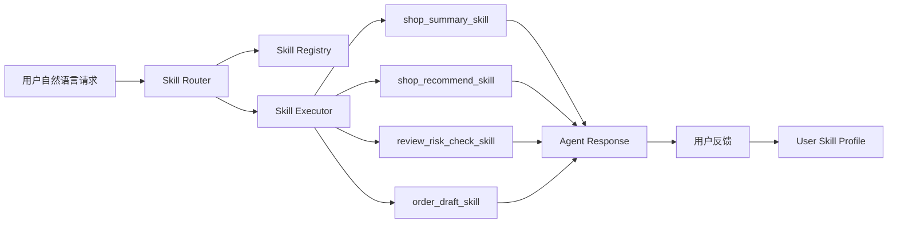

# MCP 风格 Skill 插件系统说明

## 背景

本项目原有 AI 能力包括：

- 店铺口碑总结
- AI 点评助手推荐
- 评论内容风控

这些能力原本通过固定接口直接调用，扩展新能力时需要继续堆 Controller、Service 和 DTO。为了让 AI 能力具备更好的可扩展性，本次将原有 AI 能力抽象成 MCP 风格 Skill 插件系统。

核心思想：

> LLM 不直接访问业务系统，而是通过 Skill Router 选择可注册、可校验、可控权限的 Skill，再由后端执行真实业务能力。

## 架构



## 模块结构

主目录：

```text
dianping-nginx-1.18.0/src/main/java/com/hmdp/skill
```

核心模块：

```text
skill
├── application
│   └── SkillAgentService.java
├── builtin
│   ├── ShopSummarySkill.java
│   ├── ShopRecommendSkill.java
│   ├── ReviewRiskCheckSkill.java
│   └── OrderDraftSkill.java
├── controller
│   └── SkillAgentController.java
├── core
│   ├── Skill.java
│   ├── SkillContext.java
│   └── SkillResult.java
├── executor
│   └── SkillExecutor.java
├── profile
│   └── UserSkillProfileService.java
├── registry
│   ├── SkillDefinition.java
│   └── SkillRegistryService.java
└── router
    ├── SkillRouter.java
    ├── SkillRoutePlan.java
    └── SkillCall.java
```

## 核心抽象

每个 Skill 实现统一接口：

```java
public interface Skill {
    String name();

    String type();

    String description();

    String inputSchema();

    String outputSchema();

    String permissionLevel();

    SkillResult execute(SkillContext context);
}
```

这样新增能力时，只需要新增一个 `Skill` 实现类，并在 `ai_skill_registry` 中注册元信息。

## 已实现 Skill

### shop_summary_skill

复用原有店铺口碑总结能力。

输入：

```json
{
  "shopId": 1,
  "refresh": false
}
```

输出：

```json
{
  "shopId": 1,
  "finalSummary": "...",
  "highFrequencyHighlights": [],
  "uniqueHighlights": [],
  "advice": "..."
}
```

### shop_recommend_skill

复用原有 AI 点评助手推荐能力。

输入：

```json
{
  "query": "今晚想吃火锅，便宜点，距离近一点",
  "x": 120.149993,
  "y": 30.334229,
  "currentTypeId": 1
}
```

输出：

```json
{
  "query": "...",
  "intentSummary": "...",
  "keywords": [],
  "recommendShops": []
}
```

### review_risk_check_skill

复用原有评论风控能力。

输入：

```json
{
  "scene": "BLOG_NOTE",
  "title": "今天吃火锅",
  "content": "这家店味道不错",
  "shopId": 1
}
```

输出：

```json
{
  "pass": true,
  "riskLevel": "SAFE",
  "riskScore": 5,
  "riskTags": [],
  "reasons": [],
  "suggestion": "..."
}
```

### order_draft_skill

订单草稿 Skill，只生成草稿，不自动下单、不支付、不确认订单。

权限等级：`HIGH`

调用时必须传：

```json
{
  "confirmed": true
}
```

输出：

```json
{
  "draftOnly": true,
  "shopId": 1,
  "voucherId": 10,
  "needUserConfirm": true,
  "safetyNotice": "..."
}
```

## 对外接口

### 查看 Skill 注册表

```http
GET /api/skill/registry
```

### 直接执行 Skill

```http
POST /api/skill/execute
```

示例：

```json
{
  "skillName": "shop_summary_skill",
  "userId": 1,
  "params": {
    "shopId": 1
  }
}
```

### Agent 自动路由

```http
POST /api/skill/agent/chat
```

示例：

```json
{
  "userId": 1,
  "userInput": "今晚想吃火锅，帮我推荐附近便宜点的店",
  "params": {
    "x": 120.149993,
    "y": 30.334229
  }
}
```

### 用户反馈

```http
POST /api/skill/feedback
```

示例：

```json
{
  "userId": 1,
  "skillName": "shop_recommend_skill",
  "feedbackType": "COUPON_RECEIVED",
  "payload": {
    "shopId": 1
  }
}
```

反馈会更新 `user_skill_profile`，为后续个性化推荐提供长期偏好。

## 数据表

SQL 脚本：

```text
dianping-nginx-1.18.0/src/main/resources/db/migration_20260513_skill_agent.sql
```

包含：

- `ai_skill_registry`
- `user_skill_profile`

`ai_skill_registry` 用于管理 Skill 名称、类型、描述、输入输出 Schema、权限等级、版本和启停状态。

`user_skill_profile` 用于存储用户长期偏好，例如：

```json
{
  "couponSensitivity": "high",
  "recommendAggressiveness": "low",
  "commentStyle": "user-edited"
}
```

## 安全边界

1. LLM 不直接访问数据库、Redis、RabbitMQ 或交易系统。
2. Skill 必须注册后才能调用。
3. `SkillExecutor` 会校验 Skill 是否存在、是否启用、权限等级是否满足。
4. 高风险 Skill 必须用户显式确认。
5. `order_draft_skill` 只生成草稿，不自动支付。
6. 价格、库存、优惠券资格必须由服务端重新校验。

## 当前实现状态

已完成：

- Skill 核心抽象
- Skill Registry
- Skill Executor
- Skill Router
- Agent 统一入口
- 用户反馈更新 Profile
- 原有 AI 店铺总结 Skill 化
- 原有 AI 推荐助手 Skill 化
- 原有评论风控 Skill 化
- 订单草稿安全 Skill

已验证：

```bash
cd dianping-nginx-1.18.0
mvn -q -DskipTests compile
```

编译通过。

## 后续扩展方向

可以继续新增：

- `coupon_search_skill`
- `coupon_match_skill`
- `post_recommend_skill`
- `post_summary_skill`
- `comment_draft_skill`
- `geo_filter_skill`

扩展方式：

1. 新增一个 `Skill` 实现类。
2. 在 `ai_skill_registry` 注册名称、描述、Schema、权限等级。
3. 在 `SkillRouter` 中补充路由规则，或后续接入 LLM Router。
4. 根据用户反馈更新 `user_skill_profile`。
